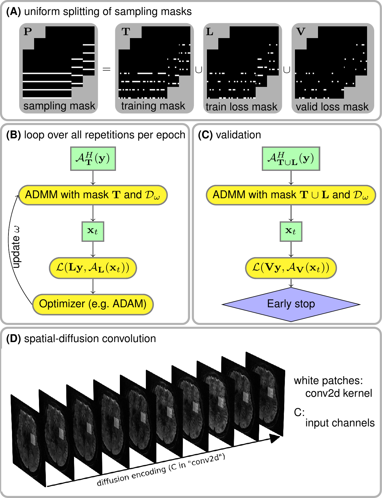
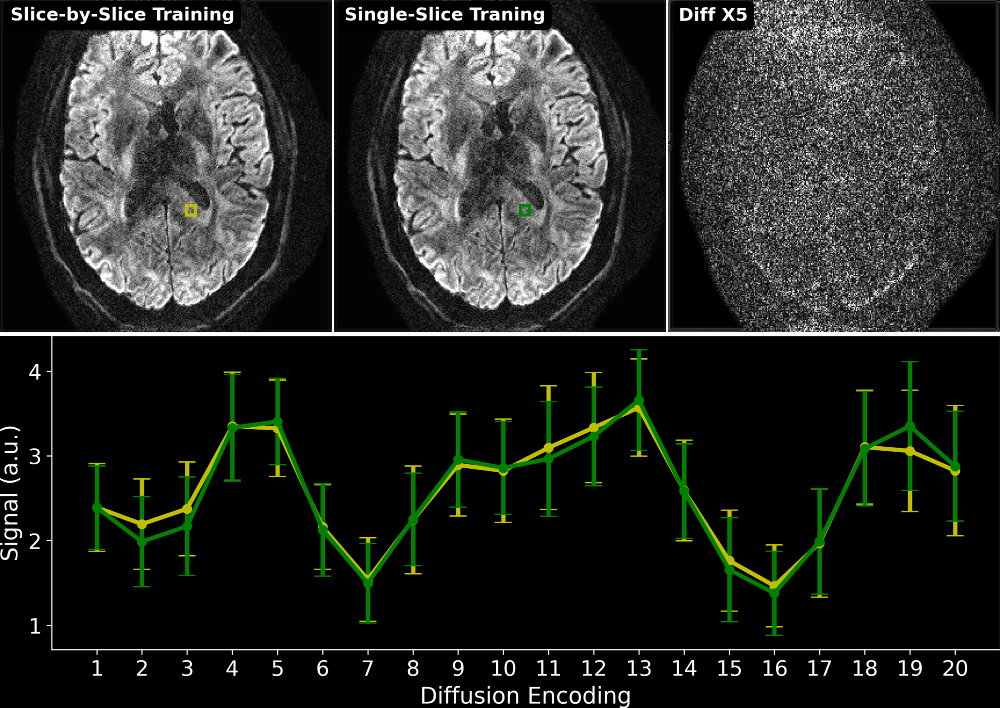
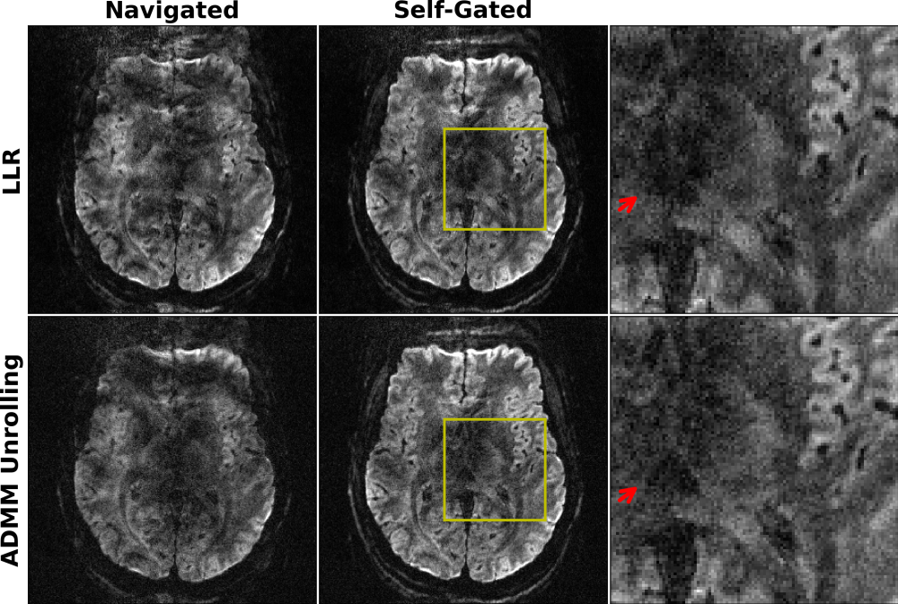
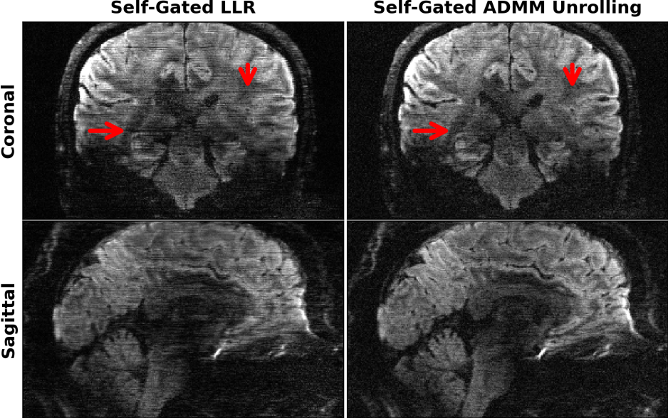
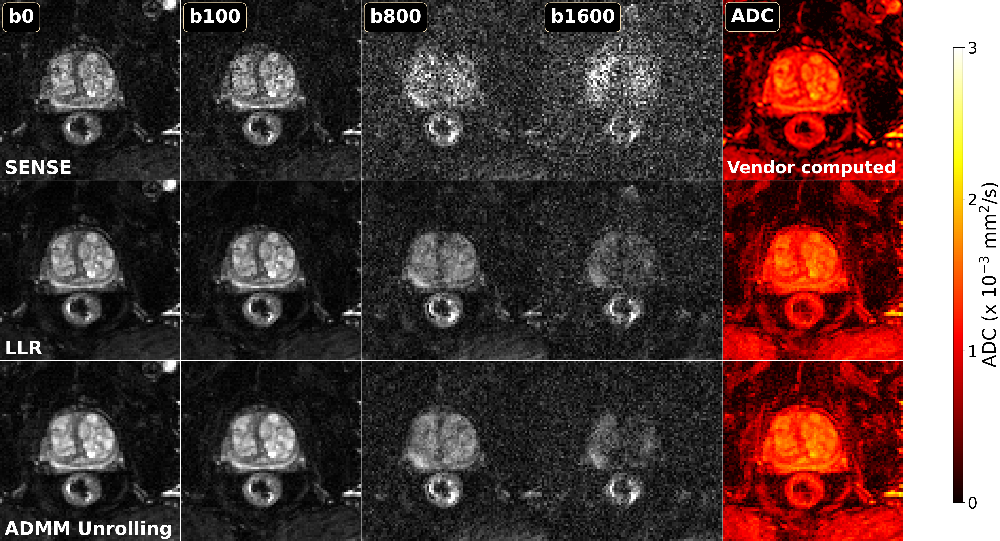

# Self-gated self-supervised ADMM unrolling enables mesoscale high-resolution motion-robust diffusion-weighted imaging

Zhengguo Tan, Patrick A Liebig, Annika Hofmann, Yun Jiang, Vikas Gulani, Frederik B Laun, Florian Knoll

## SYNOPSIS & IMPACT

**Motivation:** The lack of fully-sampled data hinders the developments of advanced deep learning techniques for diffusion-weighted imaging (DWI).

**Goal:** To develop an efficient self-supervised algorithm unrolling technique for high-resolution DWI.

**Approach:** We unroll the alternating direction method of multipliers (ADMM) to perform scan-specific self-supervised learning for deep DWI reconstruction.

**Results:** We demonstrate that (1) ADMM unrolling is generalizable across slices, (2) ADMM unrolling outperforms multiplexed sensitivity-encoding (MUSE) and compressed sensing with locally-low rank (LLR) regularization in terms of image sharpness, tissue continuity and motion robustness, (3) ADMM unrolling enables clinically feasible inference time.

**Impact: Our proposed ADMM unrolling enables whole brain DWI of 21 volumes at 0.7 mm isotropic resolution and 10 minutes scan, and shows higher signal-to-noise ratio (SNR), clearer tissue delineation, and improved motion robustness, which make it plausible for clinical translation.**

## INTRODUCTION

High-dimensional magnetic resonance imaging (HD-MRI) is a rapidly advancing field, with examples including magnetic resonance spectroscopic imaging (MRSI) [1], diffusion-weighted imaging (DWI) [2], and quantitative parameter mapping [3,4]. Despite its potential, state-of-the-art HD-MRI often requires prolonged acquisition times. While accelerated acquisition techniques, such as those using advanced compressed sensing reconstruction, can shorten acquisition, they come with the trade-off of increased computational demands.

The contribution of this work includes:

* We unroll ADMM [5] to perform scan-specific self-supervised learning and incorporate self-gated shot-to-shot phase variation estimation into the data-consistency term for deep diffusion-weighted imaging reconstruction.
* We demonstrate that the trained ADMM unrolling model from one single slice can be applied to all other slices. This significantly reduces the training time.
* We achieve navigator-free high-resolution DWI with 21 diffusion-encoding directions at 0.7 mm isotropic resolution, a scan time of under 10 minutes, and a reconstruction time of about 1 minute per slice.

## METHODS

### Data Acquisition

Three volunteers and one patient with written informed consent approved by the local ethics committee participated in the study.

#### Brain DWI at 7T

Three volunteers were scanned at 7T (MAGNETOM Terra, Siemens, Erlangen, Germany). The scanner was equipped with a 32-channel head coil (NOVA Medical, Wilmington, MA, USA) and the XR-gradient system. We implemented a mesoscal high-resolution DWI protocol with NAViEPI [6] with the following parameters: FOV 200 mm, matrix size 286 x 286 x 176, voxel size 0.7 mm $^3$, 3-shot interleaved EPI with 2x2-fold acceleration and 5/8 partial Fourier, bandwidth 972 Hz/pixel, TR/TE/ESP 8900/58/1.17 ms, and a total scan time of 10 minutes for 21 volumes (1 non-diffusion-weighted and 20 diffusion-encoded) with the b-value of 1000 s/mm$^2$.

#### Prostate DWI at 3T

One patient was scanned at 3T (MAGNETOM Vida, Siemens, Erlangen, Germany) with the clinical prostate DWI protocol utilizing single-shot EPI. The acquisition parameters were FOV 200 mm, matrix size 171 x 114 x 35, slice thickness 4 mm, 2-fold in-plane acceleration, TR/TE 6400/91 ms, and the 3-scan trace mode with b-value up to 1600 s/mm$^2$ and a total of 97 volumes. ADC was obtained as the average of three diagonal tensors, which was fitted from diffusion-weighted images with b-values of 100 and 800 s/mm$^2$.

### Forward Modeling

Joint k-q-slice reconstruction [6] formulates the forward model as,

$$\mathcal{A}(\mathbf{x}) = \mathbf{P \Sigma \Theta F S \Phi} \mathbf{x}$$

where the multi-band multi-diffusion-weighted images ($\mathbf{x}$) are point-wise multiplied with the pre-computed shot-to-shot phase variation maps ($\mathbf{\Phi}$) and coil sensitivity maps ($\mathbf{S}$). The output images are then converted to $k$-space via 2D FFT ($\mathbf{F}$), point-wise multiplied with the multi-band phases ($\mathbf{\Theta}$), summed along the slice dimension ($\mathbf{\Sigma}$), and then multiplied by the $k$-space undersampling mask ($\mathbf{P}$).

With the forward model ($\mathcal{A}$), the joint reconstruction problem reads,

$$\text{argmin}_{\mathbf{x}} \left\lVert \mathbf{y} - \mathcal{A}(\mathbf{x}) \right\rVert _2^2 + \lambda \mathcal{R}(\mathbf{x})$$

where $\mathbf{y}$ is the measured k-space data. $\mathcal{R}(\mathbf{x})$ is the regularization function, which is either nuclear norms of the local spatial-diffusion patches for LLR-regularized iterative reconstruction or deep neural networks for unrolled reconstruction. In both cases, we employ ADMM to assure fair comparison. For ADMM unrolling, we employ the 2D ResNet [7] as the regularization function.

### Self-Gated Self-Supervised ADMM Unrolling

> **Figure 1.** Key components in ADMM unrolling. (A) The sampling mask P was uniformly split into three disjoint sets: the training mask T for the data consistency term during training, the train loss mask L for the loss function calculation during training, and the validation loss mask V for the loss function calculation during validation. (B) and (C) show the flowchart for the training and the validation, respectively. The ResNet parameters are updated via ADAM during training, but remain fixed during validation. (D) All diffusion-weighted images are input to ResNet in ADMM unrolling.

Figure 1 illustartes crucial components of ADMM unrolling. Inspired by Yaman et al. [8], our proposed ADMM unrolling is scan specific, i.e., the model is trained on one single dataset. The data sampling mask $\mathbf{P}$ is split into three disjoint sets, the training mask $\mathbf{T}$ for the data consistency term, the training loss mask $\mathbf{L}$ for the loss function calculation, and the validation loss mask $\mathbf{V}$. Each set consists of 12 repetitions constructed via random uniform sampling of the data mask $\mathbf{P}$. In each training epoch, every repetition is looped through to update the ResNet parameters $\omega$. Plus, the validation step is performed after every training epoch to update the minimal validation loss. If the validation loss does not reduce for 12 consecutive epochs or if 100 epochs are reached, the training is terminated. Figure 1 (D) shows that the 2D convolution in ResNet is performed in the spatial-diffusion dimension, with the diffusion encoding as the convolution channel.

### Computation

All reconstructions were done on a A100 SXM4/NVLink GPU with 80GB memory (NVIDIA, Santa Clara, CA, USA). Computing infrastructure was provided by the Erlangen National High Performance Computing Center and in part supported through computational resources and services by Advanced Research Computing at the University of Michigan, Ann Arbor.

## RESULTS AND DISCUSSION

### Model Generalizability

> **Figure 2.** Comparison of two training strategies: (1) slice-by-slice training, where every slice is trained and tested individually; (2) single-slice training, where the unrolled ADMM model is trained on only one sliceand tested on all remaining slices. The top-right image shows the absolute difference between the reconstructed single-dir diffusion-weighted images between (1) and (2). The bottom panel plots the mean and standard deviation of the signal within color boxes in the two training strategies. No major qualitative or quantitative difference can be seen.

Figure 2 demonstrates the generalizability
of the proposed ADMM unrolling approach,
i.e., an unrolled ADMM model trained on one single slice
is applicable to all remaining "unseen" slices.
Single-direction diffusion-weighted images from
both the slice-by-slice training
and the single-slice training strategies are displayed.
The absolute difference between these two images
shows no residual structural information, but mainly noise.
Further, we plotted the mean and standard deviation
within the selected region-of-interest (colored boxes)
along all diffusion encoding.
This again proves the cross-slice generalization
of the proposed ADMM unrolling method.
The plotted curves show quantitatively similar values
between the two training strategies.

### Self-Gated Self-Supervised ADMM Unrolling

> **Figure 3.** Comparison of (top) LLR and (bottom) ADMM unrolling reconstruction on 0.7mm isotropic resolution DWI with shot phase estimated from (left) navigators and (middle) imaging echoes, respectively. The use of navigators prolongs the total scan time, and thus increases the sensitivity to motion, as shown in navigated reconstruction. The retrospectively self-gated reconstruction discards navigators, and renders sharper diffusion-weighted images. Compared to LLR, unrolled ADMM is advantageous in resolving clearer tissue boundariesin diffusion-weighted images.

Figure 3 demonstrates
the efficacy of the self-gated self-supervised ADMM unrolling reconstruction.
The single-direction diffusion-weighted images with accidental motion
are displayed. The selected diffusion encoding shows residual aliasing-like and
severe motion-blurring artifacts in the navigated reconstructions,
including both LLR regularization and ADMM unrolling.
The main reason of these artifacts is that
the acquisition of navigators
increases the total scan time,
resulting in higher sensitivity to accidental inter-shot motion.
Further, self-gated ADMM unrolling exhibits much clearer tissue delineation
in reconstructed diffusion-weighted images,
as indicated by red arrows in the zoomed-in views,
whereas self-gated LLR suffers from
slightly blurry tissue boundaries and ambiguous signals.

> **Figure 4.** Single-direction diffusion-weighted images at 0.7mm isotropic resolution as reconstructed by retrospectively self-gated (left) LLR and (right) ADMM unrolling in (top) the coronal and (bottom) the sagittal views, respectively. The same diffusion direction as in Figure 3 is chosen for display. ADMM unrolling reduces phase ambiguitiesin the shot-combined reconstruction, thereby rendering clearer tissue delineation andreducing stripping artifacts (as indicated by the red arrows).

Figure 4 shows coronal- and saggital-view
diffusion-weighted images
with the same diffusion encoding as in Figure 3.
As mentioned above, the unrolled ADMM model
was trained using only one slice
and then inferred on all remaining slices.
The model generalizes well across slices.
The inference of every slice takes only about one minute,
whereas the LLR reconstruction takes about 48 minutes per slice.
More importantly, the self-gated LLR reconstruction exhibits residual
motion-induced stripping artifacts
(refer to red arrows ),
whereas the self-gated ADMM unrolling approach substantially removes these artifacts
and supplies high-quality diffusion-weighted images without the need of navigators.

### Prostate DWI

> **Figure 5.** Comparison of reconstructions for prostate DWI: parallel imaging as SENSE, compressed sensing with LLR regularization, and ADMM unrolling. b0, diffusion-weighted images at different b-values, and ADC maps are displayed from left to right. Unlike clinical protocals which may involve the use of dedicated filtering, the ADC maps were fitted directly from reconstructed diffusion-weighted images and displayed without filtering. Both LLR and ADMM unrolling show strong denoising capabilities.

Figure 5 shows preliminary results on prostate DWI reconstructions. When compared to parallel imaging as SENSE [9], both LLR and ADMM unrolling show strong denoising. ADMM unrolling illustrates slightly better tissue contrast in the ADC map.

## CONCLUSION

We proposed a self-gated self-supervised learning reconstruction for high-resolution and motion-robust DWI. Based on the mechanism of data spliting (cross validation), our proposed ADMM unrolling requires only one slice for training and is generalized cross-slice.

## REFERENCES

[1] Brown TR, Kincaid BM, Uğurbil K. NMR chemical shift imaging in three dimensions. Proc Natl Acad Sci USA 1982;79:3523-3536.

[2] Jones DK. Diffusion MRI: Theory, methods, and applications. Oxford University Press 2010.

[3] Doneva M, Boernert P, Eggers H, Stehning C, Senegas J, Mertins A. Compressed sensing for magnetic resonance parameter mapping. Magn Reson Med 2010;64:1114-1120.

[4] Ma D, Gulani V, Seiberlich N, Liu K, Sunshine JL, Duerk JL, Griswold MA. Magnetic resonance fingerprinting. Nature 2013;495:187-192.

[5] Boyd S, Parikh N, Chu E, Peleato B, Eckstein J. Distributed optimization and statistical learning via the althernating direction method of multipliers. Foundations and Trends in Machine Learning 2010;3:1-122.

[6] Tan Z, Liebig PA, Heidemann RM, Laun FB, Knoll F. Accelerated diffusion-weighted magnetic resonance imaging at 7 T: Joint reconstruction for shift-encoded navigator-based interleaved echo planar imaging (JETS-NAViEPI). Imaging Neuroscience 2024;2:1-15.

[7] He K, Zhang X, Ren S, Sun J. Deep residual learning for image recognition. in IEEE Conference on Computer Vision and Pattern Recognition (CVPR'16). 2016:770-778.

[8] Yaman B, Hosseini SAH, Akçakaya M. Zero-shot self-supervised learning for MRI reconstruction. in 10th International Conference on Learning Representations (ICLR'10). 2022.

[9] Pruessmann KP, Weiger M, Boernert P, Boesiger P. Advances in sensitivity encoding with arbitrary k-space trajectories. Magn Reson Med 2001;46:638-651.
