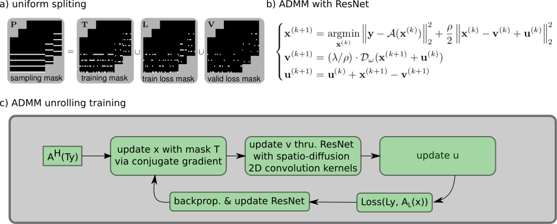

# Self-gated self-supervised ADMM unrolling enables mesoscale high-resolution motion-robust diffusion-weighted imaging

Zhengguo Tan, Patrick A Liebig, Annika Hofmann, Frederik B Laun, Florian Knoll

## SYNOPSIS & IMPACT

**Motivation:** High-resolution and motion-robust diffusion-weighted imaging (DWI) is clinically demanding.

**Goal:** To develop an efficient self-supervised algorithm unrolling technique for high-resolution DWI.

**Approach:** We unroll the alternating direction method of multipliers (ADMM) to perform scan-specific self-supervised learning for deep DWI reconstruction.

**Results:** We demonstrate that (1) ADMM unrolling is generalizable across slices, (2) ADMM unrolling outperforms compressed sensing with locally-low rank (LLR) regularization in terms of image sharpness, tissue continuity and motion robustness, (3) ADMM unrolling enables clinically feasible inference time.

**Impact: Our proposed ADMM unrolling enables whole brain DWI of 21 volumes at 0.7 mm isotropic resolution and 10 minutes scan, and shows higher signal-to-noise ratio (SNR), clearer tissue delineation, and improved motion robustness, which make it plausible for clinical translation.**

## INTRODUCTION

High-dimensional MRI is a rapidly advancing field, with examples including MRSI [1], DWI [2], and quantitative parameter mapping [3,4]. State-of-the-art high-dimensional MRI often requires prolonged acquisition times. While accelerated techniques, such as compressed sensing reconstruction, can shorten acquisition, they come with the trade-off of increased computational demands.

The contribution of this work includes:
* We unroll ADMM [5] to perform self-gated scan-specific self-supervised learning for deep DWI.
* We demonstrate the generalizability of the trained ADMM unrolling model, i.e. the model trained on one single slice is applicable to other "unseen" slices. This feature, compared to slice-by-slice training, significantly reduces the training time.
* We achieve whole-brain 0.7mm DWI with 21 diffusion-encoding directions at 10 minutes scan time.

## METHODS

### Data Acquisition

Three volunteers with written informed consent approved by the local ethics committee were scanned at 7T (MAGNETOM Terra, Siemens, Erlangen, Germany) with the mesoscale high-resolution DWI protocol based on NAViEPI [6]: FOV 200 mm, matrix size 286 x 286 x 176, 3-shot interleaved EPI with 2x2-fold acceleration and 5/8 partial Fourier, bandwidth 972 Hz/pixel, TR/TE/ESP 8900/58/1.17 ms, and a total scan time of 10 minutes for 21 volumes (1 non-diffusion-weighted and 20 diffusion-encoded) with the b-value 1000 s/mm $^2$. The total scan time is 17 minutes with navigators and 10 minutes without navigators.

### Forward Modeling and Reconstruction

Joint k-q-slice reconstruction [6] formulates the forward model as,

$$\mathcal{A}(\mathbf{x}) = \mathbf{P \Sigma \Theta F S \Phi} \mathbf{x}$$

where the multi-band multi-diffusion-weighted images ($\mathbf{x}$) is mapped to k-space via a chain of linear operators, including the shot-to-shot phase variation ($\mathbf{\Phi}$), coil sensitivities ($\mathbf{S}$), 2D FFT ($\mathbf{F}$), multi-band phases ($\mathbf{\Sigma\Theta}$), and the undersampling mask ($\mathbf{P}$). The shot phase can be estimated from either the navigator echo or the imaging echo (self-gated). With the forward model ($\mathcal{A}$), the joint reconstruction reads,

$$\text{argmin}_{\mathbf{x}} \left\lVert \mathbf{y} - \mathcal{A}(\mathbf{x}) \right\rVert _2^2 + \lambda \mathcal{R}(\mathbf{x})$$

where $\mathbf{y}$ is the measured k-space. The regularization function $\mathcal{R}(\mathbf{x})$ in this work is either nuclear norms of the local spatial-diffusion patches for LLR-regularized reconstruction or the 2D ResNet [7] for unrolled reconstruction. In both cases, we employ ADMM to assure fair comparison.

### Self-Gated Self-Supervised ADMM Unrolling

> **Figure 1.** Key components in ADMM unrolling. (A) The sampling mask P was uniformly split into three disjoint sets: the training mask T for the data consistency term during training, the train loss mask L for the loss function calculation during training, and the validation loss mask V for the loss function calculation during validation. (B) and (C) show the flowchart for the training and the validation, respectively. The ResNet parameters are updated via ADAM during training, but remain fixed during validation. (D) All diffusion-weighted images are input to ResNet in ADMM unrolling.

Inspired by Yaman et al. [8], our proposed ADMM unrolling is scan specific, i.e., the model is trained on one single dataset. The data sampling mask $\mathbf{P}$ in Figure 1 is split into three disjoint sets. Each set consists of 12 repetitions constructed via random uniform sampling of the data mask $\mathbf{P}$. In each training epoch, every repetition is looped through utilizing ADMM with the training mask $\mathbf{T}$ and the training loss mask $\mathbf{L}$ to update the ResNet parameters $\omega$. The validation loss is computed after every training epoch to update the minimal validation loss, which, if not reduced for 12 consecutive epochs, terminates the training. The 2D convolution in ResNet is performed in the spatial-diffusion dimension, with the diffusion encoding as the convolution channel. All reconstructions were done on a A100 SXM4/NVLink GPU with 80GB memory (NVIDIA, Santa Clara, CA, USA).

## RESULTS AND DISCUSSION

All following figures are gif movies displayed at 1.5 seconds/frame.

### Model Generalizability

> **Figure 2.** Comparison of two training strategies: (1) slice-by-slice training, where every slice is trained and tested individually; (2) single-slice training, where the unrolled ADMM model is trained on only one slice and tested on all remaining slices. No major qualitative or quantitative difference can be seen between the two training strategies.

Figure 2 demonstrates the generalizability of the proposed ADMM unrolling approach, i.e., an unrolled ADMM model trained on one single slice is applicable to all remaining "unseen" slices. The absolute difference along all diffusion encoding show no major difference. All following results are obtained with the single-slice training strategy.

### Self-Gated Self-Supervised ADMM Unrolling

> **Figure 3.** Comparison of (left) navigated LLR and (right) self-gated ADMM unrolling reconstruction on 0.7mm isotropic resolution DWI. The use of navigators prolongs the total scan time, and thus increases the sensitivity to motion, as shown in navigated reconstruction. The retrospectively self-gated reconstruction discards navigators, and renders sharper diffusion-weighted images. Compared to LLR, unrolled ADMM is advantageous in resolving clearer tissue boundaries in diffusion-weighted images.

Figures 3 demonstrates the efficacy of the self-gated self-supervised ADMM unrolling reconstruction. The use of navigators come with the drawbacks of elongated acquisition and higher motion sensitivity, which may result in ghosting (axial) and striping (coronal and sagittal) artifacts, such as the 5th diffusion encoding in the navigated LLR reconstruction.

> **Figure 4.** Comparison of prospectively self-gated (left) LLR and (right) ADMM unrolling reconstruction on 0.7mm isotropic resolution DWI. ADMM unrolling reduces phase ambiguities in the shot-combined reconstruction, thereby rendering clearer tissue delineation and reducing stripping artifacts.

Figure 4 shows the reconstruction results from an acquisition without navigator. The proposed ADMM unrolling illustrates much reduced axial blurring and sagittal/coronal striping artifacts than LLR. In addition, the inference of every slice takes only about one minute, whereas the implemented LLR reconstruction takes about 48 minutes per slice.

## CONCLUSION

We proposed a self-gated self-supervised learning reconstruction for high-resolution and motion-robust DWI. Based on the mechanism of data split (cross validation), our proposed ADMM unrolling requires only one slice for training and is generalized cross-slice.

## REFERENCES

[1] Brown TR, Kincaid BM, Uğurbil K. NMR chemical shift imaging in three dimensions. Proc Natl Acad Sci USA 1982;79:3523-3536.

[2] Jones DK. Diffusion MRI: Theory, methods, and applications. Oxford University Press 2010.

[3] Doneva M, Boernert P, Eggers H, Stehning C, Senegas J, Mertins A. Compressed sensing for magnetic resonance parameter mapping. Magn Reson Med 2010;64:1114-1120.

[4] Ma D, Gulani V, Seiberlich N, Liu K, Sunshine JL, Duerk JL, Griswold MA. Magnetic resonance fingerprinting. Nature 2013;495:187-192.

[5] Boyd S, Parikh N, Chu E, Peleato B, Eckstein J. Distributed optimization and statistical learning via the althernating direction method of multipliers. Foundations and Trends in Machine Learning 2010;3:1-122.

[6] Tan Z, Liebig PA, Heidemann RM, Laun FB, Knoll F. Accelerated diffusion-weighted magnetic resonance imaging at 7 T: Joint reconstruction for shift-encoded navigator-based interleaved echo planar imaging (JETS-NAViEPI). Imaging Neuroscience 2024;2:1-15.

[7] He K, Zhang X, Ren S, Sun J. Deep residual learning for image recognition. in IEEE Conference on Computer Vision and Pattern Recognition (CVPR'16). 2016:770-778.

[8] Yaman B, Hosseini SAH, Akçakaya M. Zero-shot self-supervised learning for MRI reconstruction. in 10th International Conference on Learning Representations (ICLR'10). 2022.

[9] Pruessmann KP, Weiger M, Boernert P, Boesiger P. Advances in sensitivity encoding with arbitrary k-space trajectories. Magn Reson Med 2001;46:638-651.
